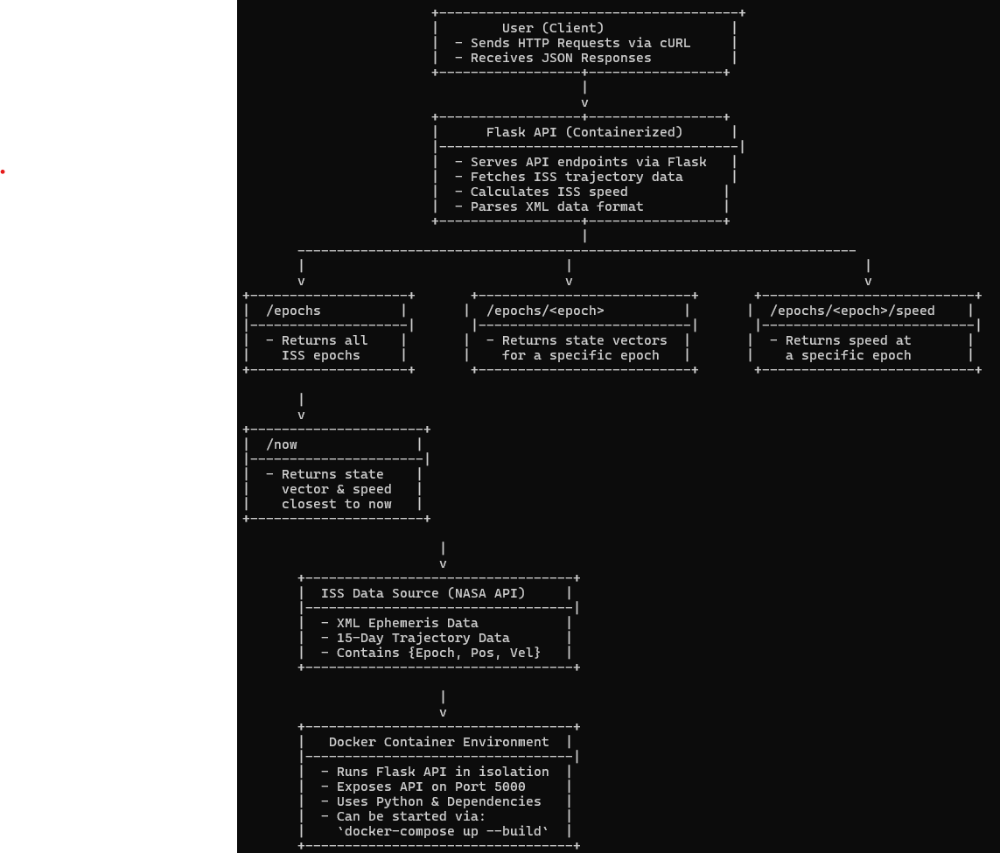

# **ISS Trajectory Tracker – Flask API**  

## **Overview**  
This project is a **Flask-based web application** that provides real-time access to **International Space Station (ISS) trajectory data**. The API allows users to retrieve **state vectors** (position and velocity data) for various timestamps (epochs) and calculate the ISS's instantaneous speed. This project extends previous work by integrating the logic into a **containerized Flask web service** that can be easily deployed and queried.  

Tracking ISS data is crucial for **space situational awareness**, **orbital mechanics research**, and **satellite communication planning**. This project provides an **accessible way to interact with the ISS’s trajectory** using REST API endpoints.  

---

## **📂 Folder Structure**  

```
my-coe332-hws/
├── homework01
│   └── ...
├── homework02
│   └── ...
├── homework03
│   └── ...
├── homework04
│   ├── ...
├── homework05
│   ├── Dockerfile          # Defines the container environment
│   ├── README.md           # This documentation file
│   ├── diagram.png         # Diagram illustrating the Flask API system
│   ├── iss_tracker.py      # Flask API script
│   ├── test_iss_tracker.py # Unit tests for the API functions
│   └── requirements.txt    # Required dependencies
└── README.md
```

---

## **📥 Accessing the ISS Data Set**  

The ISS state vectors data is obtained from **NASA’s ISS Trajectory Data website**:  
[🔗 ISS Trajectory Data (OEM)](https://spotthestation.nasa.gov)  

There are two data formats available:  
- **TXT format:** `https://nasa-public-data.s3.amazonaws.com/iss-coords/current/ISS_OEM/ISS.OEM_J2K_EPH.txt`  
- **XML format:** `https://nasa-public-data.s3.amazonaws.com/iss-coords/current/ISS_OEM/ISS.OEM_J2K_EPH.xml`  

**NOTE:** The dataset contains ISS state vectors over a **15-day period**, where each state vector includes:  
- **Epoch (timestamp)**
- **Position:** `{X, Y, Z}` (in km)
- **Velocity:** `{X_DOT, Y_DOT, Z_DOT}` (in km/s)  

This API ingests the **XML format** for easier data parsing.

---

## **🐳 Building the Container**
To build the Docker image for the Flask API, navigate to the **homework05** directory and run:

```bash
docker build -t flask-iss-tracker .
```

---

## **🚀 Running the Flask API in a Container**
Once the image is built, run the container using:

```bash
docker run -p 5000:5000 flask-iss-tracker
```
🔹 The API will now be accessible at **`http://localhost:5000`**  

Alternatively, you can use **Docker Compose** to manage the service:

```bash
docker-compose up --build
```

**To stop the container**:
```bash
docker-compose down
```

---

## **🔗 API Endpoints**
This Flask API provides multiple routes for retrieving ISS trajectory data.  

### **1️⃣ Get All Available Epochs**
**Route:**  
```plaintext
GET /epochs
```
**Example Usage (cURL Command):**  
```bash
curl -X GET "http://localhost:5000/epochs"
```
**Response (Formatted for Readability):**
```json
{
  "epochs": [
    {
      "epoch": "2025-074T11:34:54.000Z",
      "position": [2510.283, -3498.411, -5264.877],
      "velocity": [5.3675, 5.3571, -0.9957]
    },
    {
      "epoch": "2025-074T11:38:54.000Z",
      "position": [3692.135, -2101.720, -5310.004],
      "velocity": [4.4214, 6.2114, 0.6220]
    }
  ]
}
```
**Query Parameters:**  
- `limit=int` → Limits the number of epochs returned  
- `offset=int` → Skips a specified number of epochs  

**Example:**  
```bash
curl -X GET "http://localhost:5000/epochs?limit=5&offset=2"
```

---

### **2️⃣ Get State Vectors for a Specific Epoch**
**Route:**  
```plaintext
GET /epochs/<epoch>
```
**Example Usage:**  
```bash
curl -X GET "http://localhost:5000/epochs/2025-074T11:34:54.000Z"
```
**Response:**
```json
{
  "epoch": "2025-074T11:34:54.000Z",
  "position": [2510.283, -3498.411, -5264.877],
  "velocity": [5.3675, 5.3571, -0.9957]
}
```

---

### **3️⃣ Get Instantaneous Speed at an Epoch**
**Route:**  
```plaintext
GET /epochs/<epoch>/speed
```
**Example Usage:**  
```bash
curl -X GET "http://localhost:5000/epochs/2025-074T11:34:54.000Z/speed"
```
**Response:**
```json
{
  "epoch": "2025-074T11:34:54.000Z",
  "speed": 7.66
}
```
💡 **Formula for Speed Calculation:**  
\[
\text{Speed} = \sqrt{(X_{\dot})^2 + (Y_{\dot})^2 + (Z_{\dot})^2}
\]

---

### **4️⃣ Get State Vectors & Speed Closest to Now**
**Route:**  
```plaintext
GET /now
```
**Example Usage:**  
```bash
curl -X GET "http://localhost:5000/now"
```
**Response:**
```json
{
  "epoch": "2025-074T12:00:00.000Z",
  "position": [4421.075, 5150.803, -215.841],
  "velocity": [-3.483, 3.230, 6.016],
  "speed": 7.66
}
```
💡 This finds the **closest epoch** to the **current timestamp**.

---

## **🧪 Running Unit Tests**
The Flask API includes **unit tests** to verify functionality.  

### **Run Tests Inside Docker**
```bash
docker run --rm flask-iss-tracker pytest
```

### **Run Tests Locally**
```bash
pytest test_iss_tracker.py
```
**Expected Output:**
```
============================= test session starts ==============================
platform linux -- Python 3.8
collected 4 items

test_iss_tracker.py::test_calculate_speed PASSED
test_iss_tracker.py::test_compute_average_speed PASSED
test_iss_tracker.py::test_find_closest_epoch PASSED
test_iss_tracker.py::test_convert_epoch_to_datetime PASSED

========================= 4 passed in 0.12s =========================
```

---

## **📊 API System Diagram**
This diagram illustrates how the **Flask API interacts with users and ISS data**.



**📌 Diagram Description:**
- The **Flask app** runs in a **Docker container**.
- The API fetches **ISS trajectory data** from **NASA**.
- Users interact via **HTTP requests** (e.g., `curl` commands).
- The API processes and returns **ISS state vectors and speeds**.

---

## **🌟 Summary**
- This **Flask API** provides an **interactive way to query ISS trajectory data**.
- Users can **retrieve epochs, positions, velocities, and speeds** using **REST API routes**.
- The project is **fully containerized** using **Docker** and **Docker Compose**.
- Includes **unit tests** for core functions.
- A **software diagram** illustrates how the system operates.

### **📌 Text Representation of the System Diagram**  

Below is a **text-based system diagram** representing the **Flask-based ISS Tracker API** and its interaction with users, data sources, and the Docker environment.

```
                        +--------------------------------------+
                        |        User (Client)                |
                        |  - Sends HTTP Requests via cURL     |
                        |  - Receives JSON Responses          |
                        +------------------+-----------------+
                                           |
                                           v
                        +------------------+-----------------+
                        |      Flask API (Containerized)      |
                        |--------------------------------------|
                        |  - Serves API endpoints via Flask   |
                        |  - Fetches ISS trajectory data      |
                        |  - Calculates ISS speed            |
                        |  - Parses XML data format          |
                        +------------------+-----------------+
                                           |
       -----------------------------------------------------------------------
       |                                 |                                     |
       v                                 v                                     v
+--------------------+       +---------------------------+       +---------------------------+
|  /epochs          |       |  /epochs/<epoch>          |       |  /epochs/<epoch>/speed    |
|--------------------|       |---------------------------|       |---------------------------|
|  - Returns all    |       |  - Returns state vectors  |       |  - Returns speed at       |
|    ISS epochs     |       |    for a specific epoch   |       |    a specific epoch       |
+--------------------+       +---------------------------+       +---------------------------+

       |
       v
+----------------------+       
|  /now               |        
|----------------------|        
|  - Returns state    |        
|    vector & speed   |        
|    closest to now   |        
+----------------------+       

                         |
                         v
       +----------------------------------+
       |  ISS Data Source (NASA API)     |
       |----------------------------------|
       |  - XML Ephemeris Data           |
       |  - 15-Day Trajectory Data       |
       |  - Contains {Epoch, Pos, Vel}   |
       +----------------------------------+

                         |
                         v
       +----------------------------------+
       |   Docker Container Environment  |
       |----------------------------------|
       |  - Runs Flask API in isolation  |
       |  - Exposes API on Port 5000     |
       |  - Uses Python & Dependencies   |
       |  - Can be started via:          |
       |    `docker-compose up --build`  |
       +----------------------------------+
```

---

### **📌 Explanation**
- **User (Client):**  
  - Sends HTTP requests using `curl` or a browser.  
  - Receives JSON responses with ISS trajectory data.  

- **Flask API (Containerized):**  
  - Exposes multiple **routes** (`/epochs`, `/now`, etc.).  
  - Fetches ISS state vector data.  
  - Parses and processes XML data.  
  - Computes instantaneous speed.  

- **Routes Breakdown:**  
  - `/epochs` → Returns a list of all ISS epochs.  
  - `/epochs/<epoch>` → Returns **state vectors** for a specific epoch.  
  - `/epochs/<epoch>/speed` → Computes **speed** at that epoch.  
  - `/now` → Returns state vectors **closest to the current timestamp**.  

- **ISS Data Source (NASA API):**  
  - Provides **15-day trajectory data** in **XML format**.  
  - Each epoch contains `{X, Y, Z}` position & `{Ẋ, Ẏ, Ż}` velocity.  

- **Docker Container Environment:**  
  - Runs Flask API inside a **container**.  
  - Uses **Python, Flask, and dependencies** installed via `requirements.txt`.  
  - Can be deployed with:
    ```bash
    docker-compose up --build
    ```


